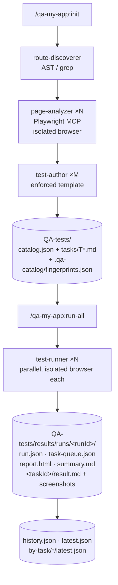

# QA My App

<p align="center">
  
</p>

[](https://github.com/elwizard33/qa-my-app/actions/workflows/validate.yml)
[](https://code.claude.com/docs/en/plugins)
[](https://code.claude.com/docs/en/plugins-reference)
[](tests/)
[](LICENSE)
[](CHANGELOG.md)

> **End-to-end QA testing as a Claude Code plugin.** Drop it into any web-app repo and Claude detects the framework, walks every page in a real browser, drives every form / modal / button / role gate, runs the whole platform in parallel, and reports back with screenshots, console logs, network traces, and filed defects. No test code to write, no fixtures to wire — the plugin understands your app from the source.

**At a glance:** 7 slash commands · 5 subagents · pluggable browser engine (Playwright default · Chrome DevTools · Stagehand/Browserbase) · 9 supported frameworks · 3 issue-tracker integrations (GitHub / Jira / Azure DevOps) · strict-validated by CI on every push · zero test code to write.

> 📖 **Full documentation:** [elwizard33.github.io/qa-my-app](https://elwizard33.github.io/qa-my-app/) — install guide, quickstart, command reference, authentication, browser engines, and architecture.

## Contents

- [Install](#install) · [Quickstart](#quickstart) · [When to use it](#when-to-use-qa-my-app)
- [The task catalog](#the-task-catalog-how-qa-my-app-keeps-runs-deterministic) · [What `/qa-my-app:init` does](#what-happens-during-qa-my-appinit) · [Issue trackers](#connecting-issue-trackers-github--jira--azure-devops)
- [Generated layout](#generated-layout-in-the-target-project) · [Architecture](#architecture) · [Subagents](#subagents) · [Frameworks](#supported-frameworks)
- [Settings](#settings-userconfig) · [Auth](#authenticating-protected-routes) · [Browser engines](#browser-engines) · [Customization](#customization) · [Compliance](#claude-code-compliance-notes)
- [Status](#status) · [Changelog](CHANGELOG.md) · [Audit log](docs/AUDIT.md) · [Architecture deep-dive](docs/ARCHITECTURE.md)

---

## What QA My App does

- **Auto-discovers your stack and routes.** Next.js, Remix, SvelteKit, Angular, Vue, Vite+React, Blazor, Flutter web, plain HTML — if it serves HTTP it's testable. Languages, package manager, build tool, UI libs, state stores, validators and existing test frameworks are detected too.
- **Drives every page in a real browser.** A dedicated browser MCP per agent, isolated contexts, every form field probed for validation, every modal opened, every destructive button rehearsed. Browser-engine agnostic — Playwright by default, with Chrome DevTools and Stagehand/Browserbase as drop-in alternatives (see [docs/browsers/](docs/browsers/README.md)).
- **Runs end-to-end at platform scale.** Parallel browser agents fan out across the whole app. A 30-route SPA full regression goes from ~40 minutes serial to ~7 minutes at `parallel_test_runners: 6`.
- **Files real defects.** Hook up GitHub, Jira, or Azure DevOps via MCP and the runner files failures directly as issues / tickets / work items with screenshots and reproduction steps attached.
- **Stays in sync with your code.** A Git pre-commit hook + Claude session hooks fingerprint every analysed source file and flag drift the moment a UI changes, so the next run tests **what the UI actually does** — not a stale plan.
- **Reviewable, replayable runs.** Every run lands in `QA-tests/results/runs/<UTC-timestamp>/` with a schema-rigid `result.md` per task, embedded screenshots, and an append-only `history.json`. Diff runs, find regressions by task id, ship a PR with the failing screenshots embedded.
- **Live HTML dashboard, zero setup.** Every run also writes a self-contained `report.html` (auto-refresh while in flight, refresh disabled once complete). Double-click to open in a browser and watch the queue drain in real time — no server, no install, no dependencies.

### When to use QA My App

| Use it when… | Use something else when… |
|---|---|
| You want broad test coverage with zero test code | You need component-level unit tests — use Jest / Vitest |
| Your app is web-based and serves HTTP | You're testing a native binary, a CLI, or a mobile app |
| You want PR-reviewable regression diffs (same input → same plan → same outputs) | You need one-shot smoke checks with no persistence — use a Playwright recorder directly |
| You want a deterministic catalog committed to your repo | You want fully model-derived ad-hoc test plans on every run |
| You want every failure filed automatically as a GitHub / Jira / ADO defect | You don't have an issue tracker connected and don't want one |

---

## The task catalog (how QA My App keeps runs deterministic)

Most "AI testing" tools re-derive *what to test* on every run — slow, non-deterministic, impossible to review. QA My App separates **understanding the app** from **running the tests** by persisting an in-repo **task catalog** under `QA-tests/`:

1. **Discover once, test forever.** The catalog is a versioned source of truth for what every page is supposed to do — every form field, every validator, every modal, every destructive button, every role gate. It lives in your repo so reviewers can read it like documentation.
2. **Standardised surface.** Every route has the same canonical task shapes — happy path, validation matrix, modal coverage, button coverage, edge cases. The runner parses and executes them deterministically.
3. **Drift-aware.** Fingerprints + hooks flag the moment a UI changes so the catalog is rebuilt only where needed.
4. **Parallel by construction.** Because tasks are uniform, the orchestrator can fan them out across N browser agents without coordination overhead.
5. **Diffable history.** Same input → same plan → same outputs → diff across commits.

The catalog is the engine room. You don't have to look at it — but it's why subsequent runs are fast, deterministic, and PR-reviewable.

---

## What this plugin does

1. **Detect the framework** (Next.js, Remix, SvelteKit, Angular, Vue, Vite+React, Blazor, Flutter web, plain HTML).
2. **Discover every route** statically from the source tree, with auth/role/guard/HTTP-method metadata.
3. **Open each page** in a real browser via the configured browser engine (Playwright by default) and inventory every form field, validator, button, modal, dialog, tab, and table.
4. **Author deep test tasks** into `QA-tests/tasks/` using an enforced template — happy path + validation matrix + modal coverage + button coverage + edge cases.
5. **Watch the codebase** via SessionStart + PostToolUse hooks and a Git pre-commit hook. When a route's source drifts from the catalog, you're nudged (or commits are blocked) until you run `/qa-my-app:sync`.
6. **Run one task, a subset, or every task in parallel** with `/qa-my-app:run` / `/qa-my-app:run-all`. Each spawn writes a date-stamped `result.md` with embedded screenshots, plus a top-level run summary and an append-only history index.

This plugin is project-agnostic — no app-specific assumptions.

---

## Install

Inside Claude Code in any project:

```text
/plugin marketplace add elwizard33/qa-my-app
/plugin install qa-my-app@qa-my-app
/reload-plugins
```

That's it — the plugin is installed at **user scope** (available in every repo) and active in your current session.

> **Upgrading from 0.1.0?** The plugin was renamed `qa-catalog` → `qa-my-app` in v1.0.0, so this is a reinstall rather than an update:
> ```text
> /plugin uninstall qa-catalog@qa-my-app
> /plugin install qa-my-app@qa-my-app
> ```
> Every command moves from `/qa-catalog:*` to `/qa-my-app:*`. Your generated `QA-tests/` directory is **untouched** — the catalog, fingerprints, results history, and `auth.local.json` all keep working, so you don't need to re-run `init`.

<details>
<summary><b>What the three commands do, and project-scope install</b></summary>

1. `/plugin marketplace add <owner/repo>` registers this repo's `marketplace.json` with your Claude Code install. No plugins installed yet — Claude Code just knows the catalog exists. ([docs](https://code.claude.com/docs/en/discover-plugins#add-marketplaces))
2. `/plugin install qa-my-app@qa-my-app` installs the `qa-my-app` plugin from the `qa-my-app` marketplace at **user scope** by default. To install at project scope so teammates pick it up automatically, run `/plugin` instead and press Enter on **qa-my-app** in the Discover tab — you'll get scope options. ([docs](https://code.claude.com/docs/en/discover-plugins#install-plugins))
3. `/reload-plugins` activates the new plugin without restarting Claude Code.

Verify it loaded by opening the plugin manager with `/plugin` and looking at the **Installed** tab — you should see **QA My App** with skills `init`, `scan`, `sync`, `status`, `run`, `run-all`, `verify`. Errors (if any) show up under the **Errors** tab.

</details>

<details>
<summary><b>Local development / contributing</b></summary>

If you've cloned this repo and want to test changes without publishing, launch Claude Code with the `--plugin-dir` flag instead:

```bash
claude --plugin-dir /path/to/qa-my-app
```

The local copy takes precedence over any installed marketplace version for that session ([docs](https://code.claude.com/docs/en/plugins#test-your-plugins-locally)).

</details>

> **Browser engine.** This plugin is browser-engine agnostic. It ships **no session-level MCP server** — the project-level browser agents (`qa-page-analyzer`, `qa-test-runner`) each declare their **own** inline `mcpServers` block, so every parallel spawn gets a dedicated browser process and the main conversation never pays for the browser tool descriptions. That's why `/qa-my-app:init` Phase 0 copies those agents into `.claude/agents/` (plugin-scoped agents ignore `mcpServers` for security reasons; project-scoped ones honor it). Set `browser_engine` to `playwright` (default), `chrome-devtools`, or `stagehand` and init writes the matching block. See [docs/browsers/](docs/browsers/README.md).

> Slash commands are exposed under the `qa-my-app:` namespace (that's the plugin's internal id) — e.g. `/qa-my-app:run-all`. The brand is QA My App; the namespace is a Claude Code plumbing detail.

> **Token efficiency (by design).** Heavy work is isolated so it never floods the main conversation: each browser agent runs in its own context window and returns only a one-line JSON summary, verbose verification is offloaded to the `verify-result.mjs` / `catalog-diff.mjs` Node scripts (a hook, not the model, does the parsing), and the deterministic `qa-test-runner` uses `effort: medium` so extended-thinking tokens aren't spent re-deriving a pre-authored task — multiplied across every parallel runner. Reasoning-heavy analysis (`qa-page-analyzer`) keeps `effort: high`. The five skills that overwrite the catalog or spawn browser runs set `disable-model-invocation: true`, which keeps their descriptions out of context entirely until you invoke them; only the two cheap entry points (`status`, `verify`) stay listed so Claude can reach them. The plugin also ships **no session-level MCP server**, so no browser tool descriptions load into your main conversation. See [docs/ARCHITECTURE.md](docs/ARCHITECTURE.md).

---

## Quickstart

```text
/qa-my-app:init                 # First-time bootstrap; builds QA-tests/
/qa-my-app:status               # Health + inventory snapshot (read-only)
/qa-my-app:sync                 # After code changes, reconcile catalog
/qa-my-app:scan                 # Force full rescan (backs up tasks first)
/qa-my-app:run T03              # Execute one task end-to-end
/qa-my-app:run-all              # Execute every task — parallel runners
/qa-my-app:run-all T01,T03,T07  # Subset by task id
/qa-my-app:run-all /customers   # Subset by route prefix
/qa-my-app:run-all failed       # Re-run only tasks whose last result was FAIL/BLOCKED
/qa-my-app:run-all changed      # Re-run only tasks whose route source is dirty

/qa-my-app:verify               # Test just what changed (this conversation + uncommitted diff)
/qa-my-app:verify PROJ-123      # Test against a Jira/issue ticket's acceptance criteria
/qa-my-app:verify --branch      # Verify the whole PR (everything different from main)
/qa-my-app:verify /customers    # Verify one route right now
```

Every `/qa-my-app:run`, `/qa-my-app:run-all`, or `/qa-my-app:verify` invocation writes a self-contained dashboard at `QA-tests/results/runs/<runId>/report.html`. Open it in a browser while the run is in flight — the page meta-refreshes every 3 seconds and shows the queue draining live (pending → dispatched → complete, with per-task verdicts, defects, and links to `result.md`). Once the run finishes, the auto-refresh disables itself and the same file becomes the canonical browse view for that run.

---

## What happens during `/qa-my-app:init`

The init skill is the orchestrator. It runs in your main Claude Code session and fans work out to specialised subagents per the canonical Claude Code pattern ([sub-agents docs](https://code.claude.com/docs/en/sub-agents) — parallel research with focused workers reporting back). Phases are sequenced because each one depends on the previous, but the page-analysis and task-author phases parallelize internally.

| Phase | Who | What | Typical scale |
|---|---|---|---|
| **_pre-amble_** Stack & framework detection | `scripts/detect-framework.mjs` (invoked in the skill's `## Project context`) | Detects framework, languages, runtime, package manager, build tool, monorepo flavor, UI libraries, state management, forms, validation libs, HTTP layer, styling, existing test/E2E frameworks. The full descriptor is persisted into `catalog.json.stack` at Phase 5. | seconds |
| **0. Install project-level browser agents** | main session | Copies `agents/qa-page-analyzer.md` and `agents/qa-test-runner.md` from the plugin into the project's `.claude/agents/` directory (left untouched if the user has customised them), and writes the `mcpServers` block for the selected `browser_engine`. These two agents declare inline `mcpServers` — a capability silently ignored on plugin-shipped agents per the [docs](https://code.claude.com/docs/en/sub-agents#scope-mcp-servers-to-a-subagent), so they must live at project scope for every parallel spawn to get its own browser process. Commit them so the whole team shares the same browser-agent versions. | seconds |
| **1. Issue-tracker MCPs** | main session + `AskUserQuestion` | Detects existing MCP connections via `claude mcp list`, then asks (multi-select) whether to wire up **GitHub**, **Jira (Atlassian)**, or **Azure DevOps**. Prints the exact `claude mcp add` commands for the ones you pick — OAuth/PATs happen in your browser, never in the transcript. Skippable. | seconds |
| **2. Route discovery** | `qa-my-app:route-discoverer` (1×) | Walks the source tree, returns rich JSON per route: path, source file, requiresAuth, rolesAllowed, guards, httpMethods, dynamicParams, layoutChain, featureFlags. | tens of seconds |
| **3. Per-page deep analysis** | `qa-page-analyzer` (× `parallel_agents`, project-level) | Each instance starts its own dedicated browser process (engine per `browser_engine`) — true isolation, no shared cookies / localStorage. Navigates one route, reads the source for validation rules, drives every form/modal/button/dialog/tab/table read-only, captures console + network. Returns a deep element-inventory JSON. | minutes — dominant cost |
| **4. Task authoring** | `qa-my-app:test-author` (× `parallel_test_authors`) | Pure markdown. Converts each Page Analysis into one or more `QA-tests/tasks/T*.md` files using the enforced template (happy path + validation matrix + modal + button + edge cases). | tens of seconds |
| **5. Catalog write** | main session | Writes `catalog.json` (with `stack` + `integrations` blocks), `catalog.md`, `routes/*.md`, `.qa-catalog/fingerprints.json`. | seconds |
| **6. Pre-commit hook install** | `scripts/install-precommit.sh` | Drops a Git pre-commit hook that re-fingerprints staged source files and blocks the commit if the catalog is stale. | seconds |
| **7. Summary receipt** | main session | Prints a **✓ checklist receipt** of everything created — framework + dev URL, routes discovered (protected / role-restricted), tasks authored, browser engine, catalog files, fingerprints recorded, issue trackers, and the pre-commit guard — then points you at `/qa-my-app:run-all` and `/qa-my-app:status`. | seconds |

> ⚠️ **The first run takes longer.** Phase 3 opens every discovered route in a real browser, one batch at a time (`parallel_agents` wide). For a typical 30-route SPA, expect **5–20 minutes** on first run depending on dev-server warm-up, network latency, auth-wall handling, and how much validation probing each page needs. **Subsequent runs are incremental:** `/qa-my-app:sync` only re-analyses routes whose source fingerprint changed.

Don't kill the session mid-init — the test-author phase writes files as analyses complete, so a partial init still produces partially-usable tasks, but the catalog won't be finalised until Phase 5.

---

## Connecting issue trackers (GitHub / Jira / Azure DevOps)

The plugin doesn't bundle the GitHub/Jira/ADO MCP servers because they each need user-specific tokens. The init skill walks you through `claude mcp add` for the ones you want at **user scope** (so the same connection works in every repo on your machine). Once connected, the `qa-test-runner` agent can:

- file defects directly as GitHub Issues / Jira tickets / ADO Work Items when a TC fails;
- link each task in `catalog.json` to the issue/epic that requested it;
- attach the run's `summary.md` and per-TC screenshots to a PR comment.

You can also wire them up later — the init Phase 1 question is just a convenience. To add them manually any time:

```bash
# GitHub (HTTP MCP, PAT-based)
claude mcp add --transport http --scope user github \
  https://api.githubcopilot.com/mcp/ \
  --header "Authorization: Bearer <YOUR_GITHUB_PAT>"

# Jira / Atlassian (HTTP MCP, OAuth in browser via /mcp)
claude mcp add --transport http --scope user atlassian https://mcp.atlassian.com/v1/sse

# Azure DevOps (stdio MCP, PAT-based)
claude mcp add --transport stdio --scope user ado \
  --env ADO_PAT=<YOUR_ADO_PAT> --env ADO_ORG=<your-org> \
  -- npx -y @azure-devops/mcp-server
```

Verify with `/mcp`. The catalog's `integrations` block records which trackers are wired so the runner knows where to file defects.

---

## Generated layout in the target project

<details>
<summary><b>Full <code>QA-tests/</code> tree</b> (click to expand)</summary>

```
QA-tests/
├── catalog.json                       # machine-readable index (source of truth)
├── catalog.md                         # human-readable table by route
├── routes/
│   └── customers.md                   # raw Page Analysis per route (element inventory)
├── tasks/
│   ├── T01-customers-list.md          # one task per significant flow
│   ├── T02-customers-create.md
│   └── ...
├── results/
│   ├── history.json                   # append-only run index
│   ├── latest.json                    # pointer to most recent run
│   ├── by-task/
│   │   └── T03-customers-edit/
│   │       └── latest.json            # pointer to most recent run that included this task
│   └── runs/
│       └── 2026-05-28T14-22-11Z/      # one folder per /qa-my-app:run[-all] invocation
│           ├── run.json               # run metadata + settings snapshot
│           ├── task-queue.json        # live task index (run-all only — source of truth during the run)
│           ├── report.html            # self-contained, auto-refreshing dashboard (open in a browser)
│           ├── summary.md             # cross-task summary table (written at end of run)
│           ├── T01-customers-list/
│           │   ├── result.md          # per-task result with embedded screenshots
│           │   ├── TC01-load.png
│           │   ├── TC02-name-empty.png
│           │   └── ...
│           └── T03-customers-edit/
│               └── ...
└── .qa-catalog/
    ├── fingerprints.json              # sha256 per analyzed source file
    └── backup-20251108-1530/          # created by /qa-my-app:scan before overwrite
```

</details>

### Task file template
Every task file is identical in shape (see [agents/test-author.md](agents/test-author.md)):

- Preconditions + required role
- Test data with concrete values
- `### TC-01` Happy path with numbered steps + assertions
- `### TC-02` Form validation matrix (one row per field × empty / pattern / max-length)
- `### TC-03` Modal coverage (cancel + confirm paths)
- `### TC-04` Button coverage (including destructive confirm + cancel)
- `### TC-05` Edge & negative cases
- Console + network expectations

### Result file schema
Every `result.md` is identical in shape (see [agents/qa-test-runner.md](agents/qa-test-runner.md)) and is validated by [scripts/verify-result.mjs](scripts/verify-result.mjs) before the runner's output is accepted into the run. Excerpt:

```markdown
# T03-customers-edit: Edit customer — Result

| Field | Value |
|---|---|
| Result | PASS / FAIL |
| Task file | QA-tests/tasks/T03-customers-edit.md |
| Route | /customers/:id |
| Date (UTC) | 2026-05-28T14:23:02Z |
| Run id | 2026-05-28T14-22-11Z |
| Duration (s) | 41 |
| Role | admin |
| Browser channel | chromium |
| Headless | true |
| Screenshots | 8 |
| Console errors | 0 |
| Network failures | 0 |

## Test Case Results

### TC-01: Happy path — PASS
- Step 1: navigate to /customers/42 — page title is "Edit customer"
- Step 2: change email — toast "Saved"

### TC-02: Form validation — customer-form — PASS
| Field | Case | Expected | Actual | Result |
|---|---|---|---|---|
| email | pattern | "Invalid email" | "Invalid email" | ✓ |

## Screenshots
### TC-01


## Defects Found
- None
```

This is parsed by [scripts/results-index.mjs](scripts/results-index.mjs) to maintain `history.json` and the per-task `latest.json` pointers.

---

## Architecture



For the full component breakdown (every script, every agent, every hook, why each runs where it does), see [docs/ARCHITECTURE.md](docs/ARCHITECTURE.md).

### Hooks (catalog drift detection)

| Trigger | Action |
|---|---|
| `SessionStart` (Claude hook, `matcher: startup`) | `catalog-diff.mjs --session-start` emits a `hookSpecificOutput.additionalContext` JSON envelope so Claude proactively knows the catalog drifted and can suggest `/qa-my-app:sync`. Status message shown to the user: "qa-my-app: checking drift". |
| `PostToolUse` after `Write\|Edit\|MultiEdit` (Claude hook, async) | Silent re-check after every file edit. Never blocks the tool loop. Status message: "qa-my-app: drift check". |
| Git `pre-commit` hook (installed by `scripts/install-precommit.sh` during `/qa-my-app:init`) | Re-fingerprints staged source files. **Blocks the commit** if `QA-tests/catalog.json` is stale and prints the routes that drifted. Bypass with `git commit --no-verify` (not recommended). |

Together, these guarantee the catalog never lags behind the UI. The moment a developer edits a page component, Claude knows; the moment they try to commit it, Git knows.

---

## Subagents

| Agent | Scope | Purpose | Tools |
|---|---|---|---|
| `qa-my-app:route-discoverer` | plugin | Static route discovery + rich metadata (auth, roles, guards, HTTP methods, dynamic params, layout chain, feature flags). | `Read, Grep, Glob, Bash` |
| `qa-page-analyzer` | **project** (installed by `/qa-my-app:init`) | Browser-driving deep element inventory per route. Each spawn starts its own `npx @playwright/mcp@0.0.78` process — true process isolation, no shared state between parallel runs. | inherits all except `Write`, `Edit`, `MultiEdit`, and destructive Bash patterns (`rm -rf *`, `git push *`, `git reset --hard *`, `npm publish *`) |
| `qa-my-app:test-author` | plugin | Pure markdown — converts page analysis into task files using the enforced template. | `Read, Write, Edit, Glob` |
| `qa-test-runner` | **project** (installed by `/qa-my-app:init`) | Browser-driving execution of one task → date-stamped `result.md` with embedded screenshots. Designed for parallel fan-out, one isolated browser per runner. | inherits all except destructive Bash patterns (`rm -rf *`, `git push *`, `git reset --hard *`, `git commit *`, `npm publish *`) |
| `qa-my-app:catalog-reconciler` | plugin | Plans add/update/delete for `catalog.json` from the drift report. | `Read, Grep, Glob` |

> The two browser-driving agents live at project scope because plugin-shipped subagents cannot declare inline `mcpServers` (silently ignored per the [docs](https://code.claude.com/docs/en/sub-agents#scope-mcp-servers-to-a-subagent)). `/qa-my-app:init` Phase 0 copies them into `.claude/agents/` so every parallel spawn gets its own dedicated Playwright process. Commit them so the whole team shares the same browser-agent versions.

All agents are `model: inherit` — they use whatever model your session is on. No model is hardcoded.

---

## Supported frameworks

| Framework | Route discovery strategy | Status |
|---|---|---|
| Next.js app dir | `app/**/page.{ts,tsx,js,jsx}` | ✅ |
| Next.js pages | `pages/**/*.{ts,tsx,js,jsx}` (excludes `_app`/`_document`/`_error`/`api`) | ✅ |
| Remix | `app/routes/**/*.{ts,tsx,js,jsx}` | ✅ |
| SvelteKit | `src/routes/**/+page.svelte` | ✅ |
| Angular | `*-routing.module.ts` + `provideRouter([{ path }])` | ✅ |
| Vue + Vue Router | `routes: [{ path }]` in `router/` | ✅ |
| Vite + React Router | `<Route path="…">` + `createBrowserRouter` | ✅ |
| Blazor (.NET) | every `*.razor` with `@page "…"` | ✅ |
| Flutter web | best-effort grep on `lib/**/*.dart` | ⚠ experimental |
| Plain HTML | every `**/*.html` outside `node_modules`/`dist`/`build` | ✅ |

Custom frameworks: add a branch to [scripts/detect-framework.mjs](scripts/detect-framework.mjs) and a strategy block to [agents/route-discoverer.md](agents/route-discoverer.md).

---

## Settings (`userConfig`)

All runtime knobs live in `.claude-plugin/plugin.json` and are editable via `/plugin`. Values marked `sensitive` go to the OS keychain, are exposed only to hook processes as `CLAUDE_PLUGIN_OPTION_<KEY>`, and never appear in transcripts — or in skill and agent content, which is why passwords are resolved from [`auth.local.json`](#authenticating-protected-routes) instead.

| Setting | Default | Purpose |
|---|---|---|
| `dev_url` | _empty_ | Override framework-detected dev URL. |
| `parallel_agents` | `3` | Concurrent `page-analyzer` agents during init/scan/sync (1–12). |
| `parallel_test_authors` | `4` | Concurrent `test-author` agents during init/scan/sync (1–16). |
| `parallel_test_runners` | `3` | Concurrent `test-runner` agents during `/qa-my-app:run-all` (1–12). |
| `browser_engine` | `playwright` | Browser-automation engine the browser agents drive: `playwright` (default, all browsers, full fidelity), `chrome-devtools` (Chrome-only, perf + Lighthouse), `stagehand` (Browserbase cloud, AI act/observe/extract — experimental). See [docs/browsers/](docs/browsers/README.md). |
| `browser_channel` | `chromium` | For `playwright` / `chrome-devtools`: `chromium`, `chrome`, `msedge`, `firefox`, `webkit`. Ignored by `stagehand`. |
| `browser_headless` | `true` | Set false to watch agents work. Ignored by `stagehand` (cloud is always headless). |
| `settle_ms` | `5000` | Wait after navigation before snapshot (0–60000). |
| `auth_mode` | `none` | `none` / `shared-credentials` / `storage-state` / `per-role`. See [Authenticating protected routes](#authenticating-protected-routes). |
| `auth_username` | _empty_ | Single shared username, used when `auth_mode = shared-credentials`. |
| `auth_password` | _empty (sensitive)_ | OS keychain only. **Not readable by the skills** — Claude Code never substitutes `sensitive` config into skill or agent content. Put the password in `auth.local.json` as a `${ENV_VAR}` reference instead; see [Authenticating protected routes](#authenticating-protected-routes). |
| `auth_storage_state_path` | _empty_ | Playwright storage-state JSON file. |
| `auth_credentials_file` | _empty_ | Per-role credential map for `auth_mode = per-role` (default `QA-tests/.qa-catalog/auth.local.json`). Gitignored; passwords referenced via `${ENV_VAR}`. |
| `default_role` | `anonymous` | Assumed role when guards don't restrict. |
| `available_roles` | _empty_ | Multi-value list (`multiple: true`) of roles the app supports — cross-referenced against route guards. |
| `task_depth` | `deep` | `deep` / `standard` / `smoke`. |
| `max_tasks_per_route` | `6` | Upper bound the test-author enforces (1–20). |
| `exclude_globs` | _empty_ | Multi-value list (`multiple: true`) of globs to skip during route discovery (e.g. `**/storybook/**`, `**/__tests__/**`). |

---

## Authenticating protected routes

Every password reaches the browser the same way: through `QA-tests/.qa-catalog/auth.local.json`, which is gitignored and holds **no literal secrets** — only usernames, storageState paths, and `${ENV_VAR}` references. [`scripts/auth-resolve.mjs`](scripts/auth-resolve.mjs) interpolates the env vars at run time and never writes a secret anywhere.

> **Why not the `auth_password` setting?** Claude Code stores `sensitive: true` plugin config in the OS keychain and — by design — **never substitutes it into skill or agent content** ([docs](https://code.claude.com/docs/en/plugins-reference#user-configuration)). A skill that wrote `${user_config.auth_password}` into a subagent payload would hand the runner that literal string, not your password. Sensitive values only reach *hook* processes, as `CLAUDE_PLUGIN_OPTION_<KEY>`. So the credential file is the supported path, and it's the one every auth mode uses.

`/qa-my-app:init` scaffolds the file and gitignores it. Fill in the roles you need:

```jsonc
{
  "version": 1,
  "defaultRole": "anonymous",
  "roles": {
    "anonymous": { "authMode": "none" },

    // shared-credentials: one login reused across protected routes.
    // Point `defaultRole` here if that's your whole auth story.
    "admin": {
      "authMode": "shared-credentials",
      "loginUrl": "/login",
      "username": "admin@acme.test",
      "password": "${QA_CRED_ADMIN_PASSWORD}"   // resolved from the environment
    },

    // storage-state: reuse a saved Playwright session, no login flow at all.
    "user": {
      "authMode": "storage-state",
      "storageStatePath": ".qa-catalog/state/user.json"
    }
  }
}
```

Export the referenced variables before a run:

```bash
export QA_CRED_ADMIN_PASSWORD='…'
```

Check what resolves — output is redacted, so it's safe to paste into an issue:

```bash
node scripts/auth-resolve.mjs --status
```

```text
QA Credentials (per-role)
=========================
  source: QA-tests/.qa-catalog/auth.local.json
  default role: anonymous
  ✓ anonymous: none
  ✓ admin: shared-credentials
  ✗ manager: shared-credentials — missing QA_CRED_MANAGER_PASSWORD
```

`/qa-my-app:status` surfaces the same line, and any role that fails to resolve has its tasks reported **BLOCKED** rather than silently failing with an empty password. `auth_mode = per-role` looks up each task's required role in this file; `shared-credentials` and `storage-state` resolve `default_role` from it.

---

## Browser engines

QA My App is **browser-engine agnostic**. The two browser-driving agents talk to a browser through an MCP server declared inline in their frontmatter, so swapping that one block swaps the engine. Pick one with the `browser_engine` setting; `/qa-my-app:init` (and `/qa-my-app:sync`) writes the matching `mcpServers` block into `.claude/agents/`.

| Engine (`browser_engine`) | MCP server | Browsers | Runs where | Best for |
|---|---|---|---|---|
| `playwright` *(default)* | `@playwright/mcp` | Chromium, Chrome, Edge, Firefox, WebKit | Local process per spawn | **Default.** Full screenshot / console / network fidelity, cross-browser, isolated local processes. |
| `chrome-devtools` | `chrome-devtools-mcp` | Chrome / Chrome for Testing only | Local process per spawn | DevTools-grade performance traces, Lighthouse audits, deep network + console. |
| `stagehand` | Browserbase MCP (Stagehand) | Cloud (Browserbase) | Remote session per spawn | AI-driven `act` / `observe` / `extract`, no local browser. **Experimental** — limited screenshot/console/network capture. |

**To switch engines:** set `browser_engine` in `/plugin`, then re-run `/qa-my-app:init` (or edit the `mcpServers:` block in your project's `.claude/agents/qa-page-analyzer.md` and `qa-test-runner.md` and commit). Full per-engine setup, requirements, and caveats live in **[docs/browsers/](docs/browsers/README.md)**:

- [Playwright (default)](docs/browsers/playwright.md)
- [Chrome DevTools](docs/browsers/chrome-devtools.md)
- [Stagehand / Browserbase](docs/browsers/stagehand.md)

> For full-fidelity QA runs (the screenshot-heavy `result.md` schema), stay on `playwright` or `chrome-devtools`. The Stagehand/Browserbase engine is best for AI-driven exploratory acts and does not expose screenshot/console/network primitives.

---

## Customization

| Want to… | Edit |
|---|---|
| Change task markdown template | [agents/test-author.md](agents/test-author.md) |
| Change result.md schema | [agents/qa-test-runner.md](agents/qa-test-runner.md) (update [scripts/verify-result.mjs](scripts/verify-result.mjs) and [scripts/results-index.mjs](scripts/results-index.mjs) parsers to match) |
| Add a framework | [scripts/detect-framework.mjs](scripts/detect-framework.mjs) + [agents/route-discoverer.md](agents/route-discoverer.md) |
| Change validation-probing depth | [agents/qa-page-analyzer.md](agents/qa-page-analyzer.md) |
| Restyle the HTML run dashboard | [templates/report.html](templates/report.html) (consumed by [scripts/render-report.mjs](scripts/render-report.mjs)) |
| Change parallel batch sizes | `/plugin` → `parallel_agents` / `parallel_test_authors` / `parallel_test_runners` |
| Switch task depth | `/plugin` → `task_depth` |
| Disable a Claude hook | edit [hooks/hooks.json](hooks/hooks.json) |
| Disable the Git pre-commit guard | `rm .git/hooks/pre-commit` (re-installs on next `/qa-my-app:init`) |

---

## Claude Code compliance notes

The plugin is validated against the published Claude Code contract (manifest, skill, sub-agent, hook references). Verified properties:

- Validation passes in both modes CI runs: `claude plugin validate .` checks `marketplace.json` (schema, duplicate names, source-path traversal, version match), and `claude plugin validate ./.claude-plugin/plugin.json` checks the plugin manifest. Both run with `--strict` in CI (or equivalently via `npx -y @anthropic-ai/claude-code plugin validate …` from a clean shell without a global `claude` install).
- Self-marketplace: `.claude-plugin/marketplace.json` follows the documented [marketplace schema](https://code.claude.com/docs/en/plugin-marketplaces) so the same repo is both the plugin source and a one-plugin catalog. Users install via `/plugin marketplace add elwizard33/qa-my-app` + `/plugin install qa-my-app@qa-my-app` — the canonical flow ([docs](https://code.claude.com/docs/en/discover-plugins)).
- **Orchestration follows the canonical "parallel research" pattern** from the [sub-agents docs](https://code.claude.com/docs/en/sub-agents): main session = supervisor, focused subagents run in parallel and report results back. Agent teams ([docs](https://code.claude.com/docs/en/agent-teams)) were considered and rejected — they're flagged experimental, require an env-flag opt-in, and the split-pane mode needs tmux or iTerm2 ("isn’t supported in VS Code’s integrated terminal, Windows Terminal, or Ghostty"). For uniform, non-conversational work like "drive each route and write a result.md" the subagent fan-out gives the same parallelism at a fraction of the token cost and zero environmental dependencies.
- All subagents use `model: inherit` — the user's session model is honored, never hardcoded.
- Plugin-shipped subagents omit the banned frontmatter fields (`hooks`, `mcpServers`, `permissionMode`). The two browser-driving agents (`qa-page-analyzer`, `qa-test-runner`) declare inline `mcpServers` — a capability silently ignored on plugin agents per the [docs](https://code.claude.com/docs/en/sub-agents#scope-mcp-servers-to-a-subagent) — so they run at **project scope**. To stop them from *also* loading as broken plugin-namespaced duplicates (`qa-my-app:qa-page-analyzer` with no browser, wasting session context), `plugin.json` declares an explicit `agents` allowlist of only the three true plugin subagents (`route-discoverer`, `test-author`, `catalog-reconciler`). The two browser agents ship in `agents/` purely as templates that `/qa-my-app:init` Phase 0 copies into `.claude/agents/`. Pointing the `agents` allowlist into the default `agents/` folder raises no `/doctor` warning per the [reference](https://code.claude.com/docs/en/plugins-reference#path-behavior-rules).
- Invocation control is scoped to risk. The five skills that overwrite the catalog or spawn browser runs (`init`, `scan`, `sync`, `run`, `run-all`) set `disable-model-invocation: true` so Claude can't auto-trigger a destructive or costly operation; the read-only `status` and the change-scoped `verify` omit it so Claude can reach them from natural phrasing. Per the [skills docs](https://code.claude.com/docs/en/skills#control-who-invokes-a-skill), that flag also removes a skill's description from context entirely — so a `when_to_use` block on a manual-only skill is inert by design, not an oversight.
- All workflow skills declare every spawned agent in `allowed-tools` — plugin-scope ids (`Agent(qa-my-app:route-discoverer)`, `Agent(qa-my-app:test-author)`, `Agent(qa-my-app:catalog-reconciler)`) and project-scope ids (`Agent(qa-page-analyzer)`, `Agent(qa-test-runner)`).
- `hooks/hooks.json` uses exec form (`command + args`), seconds-based timeouts, and `async: true` for the observational `PostToolUse` hook.
- Sensitive `userConfig` fields are `sensitive: true` and exposed only via env vars (`CLAUDE_PLUGIN_OPTION_<KEY>`).
- Every path reference uses `${CLAUDE_PLUGIN_ROOT}` so the plugin works regardless of install location.
- Subagents cannot spawn other subagents (per Claude docs). The parallel run-all orchestrator therefore lives in the **skill** layer (main session), which fans work out to N `qa-test-runner` subagents in batches.
- The nine Node helpers under `scripts/` — the deterministic backbone: drift detection, the `result.md` schema gate, credential resolution — are covered by **46 behavioural tests** under [`tests/`](tests/), run in CI on every push. Built on the stdlib [`node:test`](https://nodejs.org/api/test.html) runner, so the repo keeps its zero-dependency posture: `npm test` needs no install. Tests assert on both stdout JSON **and exit codes**, since `catalog-diff --precommit`, `auth-resolve`, and `verify-result` all signal through the exit code. The suite is mutation-checked — deliberately breaking a rule makes exactly the test that covers it fail.
- Issue-tracker MCPs (GitHub/Jira/ADO) are configured by the user at user-scope via `claude mcp add`, per [MCP docs](https://code.claude.com/docs/en/mcp). The plugin only prompts and prints the commands — it never stores credentials in the manifest.

---

## License

MIT

---

## Status

- **Version:** [0.2.0](CHANGELOG.md) — pinned, bumped on every release.
- **CI:** strict-validated on every push and PR (see the [Validate plugin](https://github.com/elwizard33/qa-my-app/actions/workflows/validate.yml) workflow).
- **Audits:** 6 enterprise-hardening passes against the Claude Code docs + most-installed community plugins. See [docs/AUDIT.md](docs/AUDIT.md) for the running log — every finding has a stable `F-NNN` id.
- **Roadmap:** track new findings + deferred work in the [audit log](docs/AUDIT.md) (deferred items carry the ⚠️ Open status).
- **Contributing:** see [CONTRIBUTING.md](CONTRIBUTING.md) · [SECURITY.md](SECURITY.md) · [AGENTS.md](AGENTS.md).

## Star history

[](https://www.star-history.com/#elwizard33/qa-my-app&Date)
