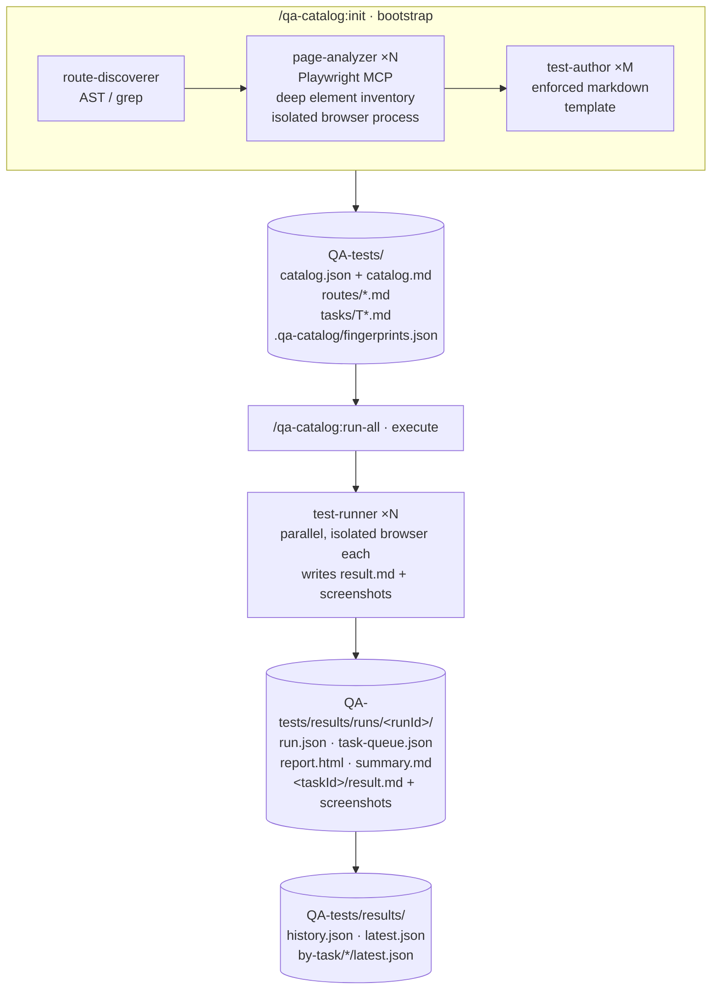

# QA My App — Architecture

> Detailed architecture reference. The [README](../README.md) carries the elevator-pitch version; this file is the full diagram + per-component breakdown.

## High-level flow

## Component responsibilities

| Layer | Component | Source | Responsibility |
|---|---|---|---|
| Skill | `/qa-catalog:init` | [skills/init/SKILL.md](../skills/init/SKILL.md) | First-time bootstrap orchestrator; runs in the user's main session, fans work to subagents in phases. |
| Skill | `/qa-catalog:sync` | [skills/sync/SKILL.md](../skills/sync/SKILL.md) | Incremental reconciler — only re-analyses routes whose source fingerprint changed. |
| Skill | `/qa-catalog:status` | [skills/status/SKILL.md](../skills/status/SKILL.md) | Read-only health + inventory snapshot: browser-agent install state, catalog framework/route/task counts, configured issue trackers, drift vs. source, and the last run's pass/fail/blocked totals. |
| Skill | `/qa-catalog:scan` | [skills/scan/SKILL.md](../skills/scan/SKILL.md) | Force full rescan (backs up `tasks/` first). |
| Skill | `/qa-catalog:run` | [skills/run/SKILL.md](../skills/run/SKILL.md) | Execute a single task end-to-end. |
| Skill | `/qa-catalog:run-all` | [skills/run-all/SKILL.md](../skills/run-all/SKILL.md) | Execute many tasks in parallel, supervisor loop with verification + retry. |
| Skill | `/qa-catalog:verify` | [skills/verify/SKILL.md](../skills/verify/SKILL.md) | Change/ticket-scoped inner loop: resolves scope from the conversation + uncommitted diff (default), a branch/PR range, a route, or a connected tracker's acceptance criteria; re-authors the affected tasks and runs them, reporting pass/fail per acceptance criterion. |
| Subagent (plugin) | `qa-catalog:route-discoverer` | [agents/route-discoverer.md](../agents/route-discoverer.md) | Walks the source tree, returns rich JSON per route. |
| Subagent (plugin) | `qa-catalog:test-author` | [agents/test-author.md](../agents/test-author.md) | Converts each Page Analysis JSON into one or more `T*.md` task files. |
| Subagent (plugin) | `qa-catalog:catalog-reconciler` | [agents/catalog-reconciler.md](../agents/catalog-reconciler.md) | Pure planner — turns a drift report into an add/update/delete plan. |
| Subagent (**project**) | `qa-page-analyzer` | [agents/qa-page-analyzer.md](../agents/qa-page-analyzer.md) | Drives one route in an isolated Playwright process. Installed to `.claude/agents/` by `init` Phase 0 because plugin-shipped agents can't declare inline `mcpServers`. |
| Subagent (**project**) | `qa-test-runner` | [agents/qa-test-runner.md](../agents/qa-test-runner.md) | Executes one task end-to-end → `result.md` + screenshots. Same project-scope reasoning as the analyzer. |
| Script | `detect-framework.mjs` | [scripts/detect-framework.mjs](../scripts/detect-framework.mjs) | Detects framework, languages, package manager, build tool, UI libs, validators, etc. |
| Script | `catalog-diff.mjs` | [scripts/catalog-diff.mjs](../scripts/catalog-diff.mjs) | Drift detector. Modes: `--json`, `--silent`, `--notify`, `--precommit`, `--session-start`, `--post-tool`. |
| Script | `change-scope.mjs` | [scripts/change-scope.mjs](../scripts/change-scope.mjs) | Maps changed source files (working tree default; `--staged`, `--branch [base]`, `--files`) onto `catalog.routes[].sourceFile`/`layoutChain` → the routes + tasks `/qa-catalog:verify` should re-author and run. |
| Script | `fingerprint.mjs` | [scripts/fingerprint.mjs](../scripts/fingerprint.mjs) | SHA-256 each cataloged source file → `.qa-catalog/fingerprints.json`. |
| Script | `verify-result.mjs` | [scripts/verify-result.mjs](../scripts/verify-result.mjs) | Schema gate on `result.md` before the runner's output enters the run. |
| Script | `results-index.mjs` | [scripts/results-index.mjs](../scripts/results-index.mjs) | Maintains `history.json`, `latest.json`, and per-task `by-task/*/latest.json` pointers. |
| Script | `status.mjs` | [scripts/status.mjs](../scripts/status.mjs) | Read-only inventory aggregator for `/qa-catalog:status`: browser-agent install state, route/task counts, integrations, last-run totals. Supports `--json`. |
| Script | `auth-resolve.mjs` | [scripts/auth-resolve.mjs](../scripts/auth-resolve.mjs) | Read-only per-role credential resolver. Reads the gitignored `QA-tests/.qa-catalog/auth.local.json`, interpolates `${ENV_VAR}` passwords, and returns the `credentialsByRole` map (or a redacted status via `--status`). Never writes secrets. |
| Script | `render-report.mjs` | [scripts/render-report.mjs](../scripts/render-report.mjs) | Renders the self-contained `report.html` dashboard from the live `task-queue.json`. |
| Script | `install-precommit.sh` | [scripts/install-precommit.sh](../scripts/install-precommit.sh) | Drops the Git pre-commit guard during `init`. |
| Hook | `SessionStart (matcher: startup)` | [hooks/hooks.json](../hooks/hooks.json) | Injects drift context into Claude's session via `hookSpecificOutput.additionalContext`. |
| Hook | `PostToolUse Write\|Edit\|MultiEdit` | [hooks/hooks.json](../hooks/hooks.json) | Async re-check after every file edit. Never blocks the tool loop. |
| MCP | `playwright` | [.mcp.json](../.mcp.json) | Bundled Playwright MCP (stdio, `npx @playwright/mcp@latest`). The project-scope browser agents declare their **own** inline `mcpServers` so each parallel spawn gets its own dedicated process. |

## Catalog model

QA My App separates **understanding the app** from **running the tests** via a persistent, in-repo `QA-tests/` directory:

- `catalog.json` — single source of truth. Includes `stack` (framework + libs descriptor) + `integrations` (which issue tracker is wired) + per-route metadata.
- `catalog.md` — human-readable mirror sorted by route.
- `routes/<route-slug>.md` — raw Page Analysis JSON per route (element inventory).
- `tasks/T<NN>-<route-slug>-<flow-slug>.md` — one task per significant user flow, enforced template.
- `.qa-catalog/fingerprints.json` — SHA-256 per cataloged source file. Drives drift detection.

Because tasks are uniform in shape, the orchestrator can fan them out across N runners with zero coordination overhead. Same input → same plan → same outputs → diff across commits.

## Hooks (drift detection)

| Trigger | Action |
|---|---|
| `SessionStart` (`matcher: startup`) | Emits `hookSpecificOutput.additionalContext` JSON so Claude proactively knows the catalog drifted and can suggest `/qa-catalog:sync` at session boot. Status: "qa-catalog: checking drift". |
| `PostToolUse` after `Write\|Edit\|MultiEdit` (async) | Silent re-check after every file edit. Never blocks the tool loop. Status: "qa-catalog: drift check". |
| Git `pre-commit` | Re-fingerprints staged source files. **Blocks the commit** if `QA-tests/catalog.json` is stale and prints the routes that drifted. Bypass with `git commit --no-verify` (not recommended). |

## Why two project-scope agents

Plugin-shipped subagents **cannot** declare inline `mcpServers` — the field is silently ignored ([docs](https://code.claude.com/docs/en/sub-agents#scope-mcp-servers-to-a-subagent)). To give each parallel spawn its own dedicated Playwright process (true OS-level isolation, no shared cookies/localStorage/auth state between runs), the two browser-driving agents must live at **project scope**. `/qa-catalog:init` Phase 0 copies them from the plugin into the project's `.claude/agents/` directory. Commit them so the whole team shares the same browser-agent versions.

Because `qa-page-analyzer.md` and `qa-test-runner.md` physically sit in the plugin's `agents/` directory (so `init` can read them via `${CLAUDE_PLUGIN_ROOT}`), they would otherwise be auto-discovered and registered as plugin agents `qa-catalog:qa-page-analyzer` / `qa-catalog:qa-test-runner` — with `mcpServers` stripped, i.e. no browser, plus duplicate always-on context cost. To prevent that, `plugin.json` declares an explicit `agents` allowlist containing **only** the three true plugin subagents. The default `agents/` scan is then skipped; the two browser files are treated purely as copy-templates. Pointing the allowlist into the default folder raises no `/doctor` warning ([path-behavior rules](https://code.claude.com/docs/en/plugins-reference#path-behavior-rules)).

## Why two parallelism knobs (not one)

- `parallel_agents` — analyzer concurrency during `init`/`scan`/`sync`. Each agent spawns a real browser; the practical ceiling is whatever the dev server can serve concurrently.
- `parallel_test_authors` — pure markdown generation, no browser. Safe to keep high.
- `parallel_test_runners` — runner concurrency during `run-all`. Same browser-process cost as analyzers; the dev server's request capacity is the practical ceiling.

## Why the supervisor lives in the skill layer

Subagents cannot spawn other subagents (per Claude docs). The `run-all` parallel orchestrator therefore lives in the **skill** (main session), which fans work out to N `qa-test-runner` subagents in batches, awaits each batch, verifies each `result.md` against the schema, retries failed verifications once, and then writes the cross-task `summary.md`.
