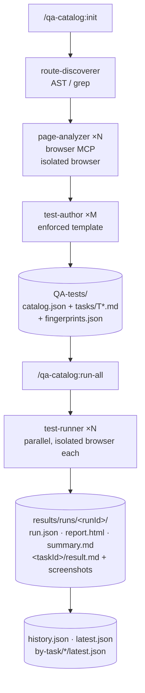

## High-level flow

## Component responsibilities

| Layer | Component | Responsibility |
|---|---|---|
| Skill | `/qa-catalog:init` | First-time bootstrap orchestrator; runs in the main session, fans work to subagents in phases. |
| Skill | `/qa-catalog:sync` | Incremental reconciler — only re-analyses routes whose source fingerprint changed. |
| Skill | `/qa-catalog:scan` | Force full rescan (backs up `tasks/` first). |
| Skill | `/qa-catalog:run` | Execute a single task end-to-end. |
| Skill | `/qa-catalog:run-all` | Execute many tasks in parallel, supervisor loop with verification + retry. |
| Subagent (plugin) | `qa-catalog:route-discoverer` | Walks the source tree, returns rich JSON per route. |
| Subagent (plugin) | `qa-catalog:test-author` | Converts each Page Analysis JSON into one or more `T*.md` task files. |
| Subagent (plugin) | `qa-catalog:catalog-reconciler` | Pure planner — turns a drift report into an add/update/delete plan. |
| Subagent (**project**) | `qa-page-analyzer` | Drives one route in an isolated browser process. Installed to `.claude/agents/` by `init` Phase 0 because plugin-shipped agents can't declare inline `mcpServers`. |
| Subagent (**project**) | `qa-test-runner` | Executes one task end-to-end → `result.md` + screenshots. Same project-scope reasoning as the analyzer. |
| Script | `detect-framework.mjs` | Detects framework, languages, package manager, build tool, UI libs, validators, etc. |
| Script | `catalog-diff.mjs` | Drift detector. Modes: `--json`, `--silent`, `--notify`, `--precommit`, `--session-start`, `--post-tool`. |
| Script | `fingerprint.mjs` | SHA-256 each cataloged source file → `.qa-catalog/fingerprints.json`. |
| Script | `verify-result.mjs` | Schema gate on `result.md` before the runner's output enters the run. |
| Script | `results-index.mjs` | Maintains `history.json`, `latest.json`, and per-task pointers. |
| Script | `render-report.mjs` | Renders the self-contained `report.html` dashboard from the live `task-queue.json`. |
| Script | `install-precommit.sh` | Drops the Git pre-commit guard during `init`. |
| Hook | `SessionStart (matcher: startup)` | Injects drift context into Claude's session via `hookSpecificOutput.additionalContext`. |
| Hook | `PostToolUse Write\|Edit\|MultiEdit` | Async re-check after every file edit. Never blocks the tool loop. |
| MCP | `playwright` | Bundled Playwright MCP (stdio) for the main session. The project-scope browser agents declare their **own** inline `mcpServers` so each parallel spawn gets its own dedicated process. |

## Why two project-scope agents

Plugin-shipped subagents **cannot** declare inline `mcpServers` — the field is silently ignored ([docs](https://code.claude.com/docs/en/sub-agents#scope-mcp-servers-to-a-subagent)). To give each parallel spawn its own dedicated browser process (true OS-level isolation, no shared cookies/localStorage/auth state), the two browser-driving agents must live at **project scope**. `/qa-catalog:init` Phase 0 copies them from the plugin into `.claude/agents/`.

Because they physically sit in the plugin's `agents/` directory, they would otherwise be auto-registered as plugin agents with `mcpServers` stripped (no browser, plus duplicate context cost). To prevent that, `plugin.json` declares an explicit `agents` allowlist containing **only** the three true plugin subagents.

## Why the supervisor lives in the skill layer

Subagents cannot spawn other subagents (per Claude docs). The `run-all` orchestrator therefore lives in the **skill** (main session), which fans work out to N `qa-test-runner` subagents in batches, awaits each batch, verifies each `result.md`, retries failed verifications once, and writes the cross-task `summary.md`.
